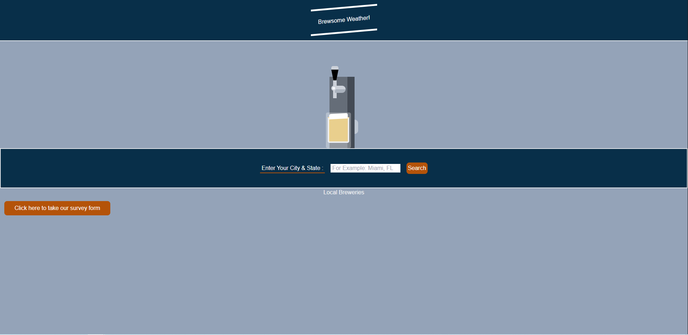
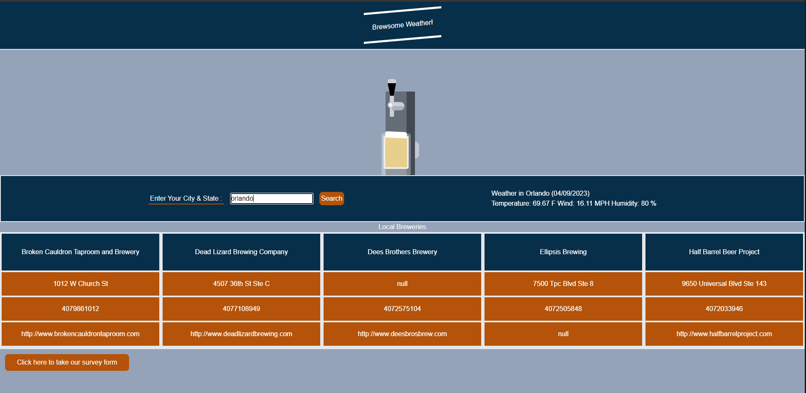
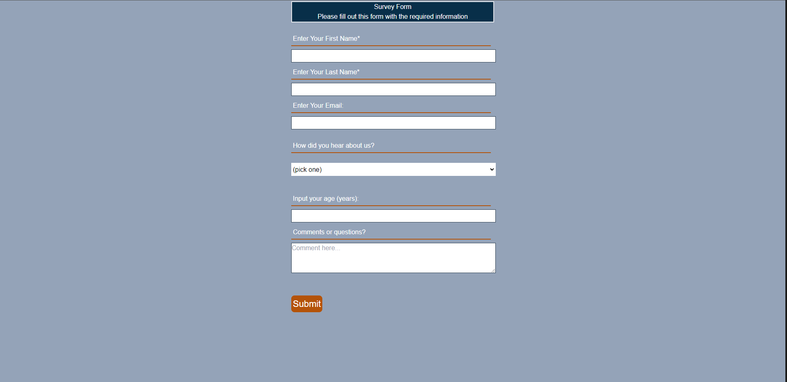

# Project: Brewsome Weather
# 07 Project 1: Interactive Front-End Application

## Proposal: Find my local bar

## Description

- What was your motivation? The movitation for this project was to help build a site where you can explore and locate your local breweries and enjoy a wonderful experience with a weather update.
- Why did you build this project? We built this project to help understand and deploy a project from the beginning to the end and learn from this experience. 
- What problem does it solve? It is a convenient way to explore a new brewery in a new place that you would like to visit and conveniently cheeck the weather.
- What did you learn? We learned how to work together as a team, better ways to build our code, and understand the project from a holisitic approach.

## User Story

```
AS A User
I WANT to see where my local brewery is
SO THAT I can buy a beer and check the weather
```

## Acceptance Criteria

```
GIVEN I need to find the closest brewery
WHEN I enter my city
THEN I am presented with a list of breweries with the local weather
WHEN I click on the breweries' website
THEN I am directed to their site.
```

* The URL of the deployed application: https://floretdemola.github.io/group-project-01/

* The URL of the GitHub repository, with a unique name and a README describing the project: https://github.com/floretdemola/group-project-01

### Code Sources

* https://codepen.io/HugoGroutel/pen/JjWJMV


### Screenshots





---
© 2023 edX Boot Camps LLC. Confidential and Proprietary. All Rights Reserved.
